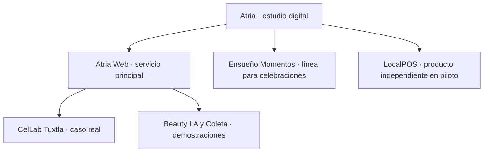

# Arquitectura actual de la landing de Atria

**Actualizado:** 3 de agosto de 2026  
**Rama:** `codex/feature/redesign-atria`  
**Estado:** segunda iteración local validada; sin despliegue.

Este documento describe la landing después del rediseño comercial. Sirve como mapa para decidir qué contenido completar cuando existan más clientes, evidencia y definiciones comerciales.

## 1. Arquitectura de marca

- **Atria** es la marca madre y el estudio remoto.
- **Atria Web** reúne sitios y presencia online para negocios.
- **Ensueño Momentos** crea experiencias digitales para celebraciones.
- **LocalPOS** es un producto independiente desarrollado por Atria.
- **CelLab Tuxtla** es un caso real, no un servicio.
- **Beauty LA y Coleta** son demostraciones, no clientes.

## 2. Secuencia comercial

La experiencia sigue el recorrido **atraer → orientar → demostrar → explicar → generar confianza → facilitar contacto**.

| Orden | Sección | Pregunta que responde | Componente |
|---:|---|---|---|
| 1 | Header | ¿Cómo navego y comienzo? | `Header.tsx` |
| 2 | Hero | ¿Qué es Atria y qué promete? | `HeroSection.tsx` |
| 3 | Índice del estudio | ¿Por qué ruta puedo entrar? | `SolutionRouter.tsx` |
| 4 | Archivo vivo | ¿Qué trabajo real, demos y productos puedo abrir? | `WorkShowcase.tsx` |
| 5 | Qué es Atria | ¿Qué clase de estudio es? | `AtriaIntroSection.tsx` |
| 6 | Atria Web por capas | ¿Cómo se convierte una necesidad en un sitio publicado? | `ServicesSection.tsx` |
| 7 | Laboratorio de demos | ¿Cómo cambia la dirección visual según el contexto? | `DemoLabSection.tsx` |
| 8 | Presencia online | ¿Cómo se conecta el sitio con Google y contacto? | `OnlinePresenceSection.tsx` |
| 9 | Bitácora visual | ¿Cómo puede crecer una relación digital? | `AtriaScrollExperience.tsx` |
| 10 | Ensueño Momentos | ¿Qué sucede antes, durante y después? | `EnsuenoEventosSection.tsx` |
| 11 | LocalPOS | ¿Qué herramienta operativa existe? | `EnsuenoPOSSection.tsx` |
| 12 | Audiencia | ¿Para quién trabaja Atria? | `AudienceSection.tsx` |
| 13 | Tablero de proyecto | ¿Quién hace qué y qué deja cada etapa? | `ProcessSection.tsx` |
| 14 | Niveles de intervención | ¿Qué profundidad puede tener el trabajo? | `PackagesSection.tsx` |
| 15 | FAQ | ¿Qué condiciones y dudas debo conocer? | `FAQSection.tsx` |
| 16 | Nota del estudio | ¿Quién está detrás de Atria? | `StudioSection.tsx` |
| 17 | Brief contextual | ¿Cómo comparto mi contexto sin empezar desde cero? | `ContactSection.tsx` |
| 18 | Footer | ¿Dónde encuentro canales, productos y legales? | `FinalCTASection.tsx` |

## 3. Fuentes de contenido

- `src/data/atria-work.ts`: casos, demos y productos con tipo, etiqueta, imagen y destino.
- `src/data/atria-content.ts`: planes, preguntas frecuentes y contextos de contacto.
- `src/data/atria-studio.ts`: rutas del estudio, capas de Atria Web y estados del tablero.
- `src/lib/site.ts`: nombre, URL, contacto y metadata base.
- `src/lib/scroll-stages.ts`: narrativa y recursos del scrollytelling.

Centralizar aquí evita que nombres, etiquetas o enlaces diverjan entre secciones.

## 4. Sistema visual

- **Dirección:** estudio editorial claro, tecnológico y cercano.
- **Paleta:** gris claro, blanco, crema, negro y terracota; cobre y oro solo en Ensueño.
- **Tipografía:** Manrope para interfaz y lectura; Cormorant Garamond para titulares editoriales.
- **Composición:** bandas completas, listas tipográficas, mockups grandes y asimetría funcional.
- **Controles:** navegación líquida contenida, foco visible y objetivos táctiles de al menos 44 px.
- **Movimiento:** GSAP solo donde explica continuidad, transformaciones y estado; móvil conserva lectura natural.

## 5. Arquitectura técnica

`CinematicLanding.tsx` ensambla la landing. Los componentes permanecen mayormente como Server Components; solo el menú, selector, contacto y motion usan estado cliente.

Rutas públicas relacionadas:

| Ruta | Función | Indexación |
|---|---|---|
| `/` | Landing Atria | Producción: indexable |
| `/demo/estetica` | Beauty LA | `noindex` |
| `/demo/comida` | Coleta | `noindex` |
| `/demo/coleta` | Alias existente de Coleta | `noindex` |
| `/demo/taller` | Demo histórica Cellux | `noindex`, fuera del portfolio |
| `/privacidad` | Aviso existente | Requiere revisión legal |
| `/terminos` | Términos existentes | Requiere revisión legal |

No forman parte de esta arquitectura el panel, autenticación, APIs, base de datos ni rutas operativas.

## 6. Evidencia actual

**Se puede publicar:** CelLab como caso real, LocalPOS como piloto, Beauty LA y Coleta como demostraciones.

**No existe todavía:** testimonios autorizados, métricas comerciales, logos adicionales, demos nuevas de Ensueño, redes oficiales y casos de estudio detallados.

Cada futuro caso debería registrar: contexto, objetivo, alcance, decisiones, fecha, capturas, resultado medido, autorización y testimonio.

## 7. Información por completar

1. Dominio definitivo y correo bajo dominio propio.
2. Validación formal de precios, cupo del piloto y tiempos públicos.
3. Condiciones legales revisadas por una persona competente.
4. Política de revisiones, cancelación, migración y soporte.
5. Evidencia autorizada de CelLab y futuros clientes.
6. Analytics, eventos de conversión y verificación de Search Console.
7. Disponibilidad operativa para sostener la respuesta el mismo día.

## 8. Criterio para futuras secciones

Una nueva sección debe aclarar la oferta, demostrar capacidad, resolver una objeción real, reducir incertidumbre o facilitar una acción. Si solo repite una promesa, agrega una cifra sin evidencia o introduce movimiento sin mejorar la comprensión, no debe incorporarse.
